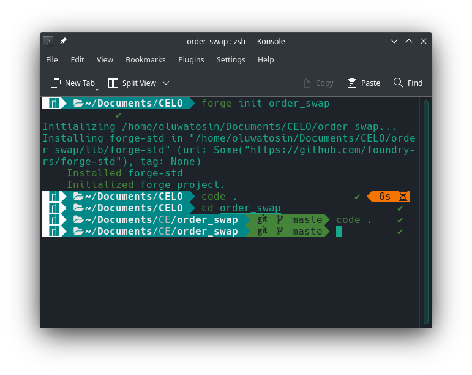
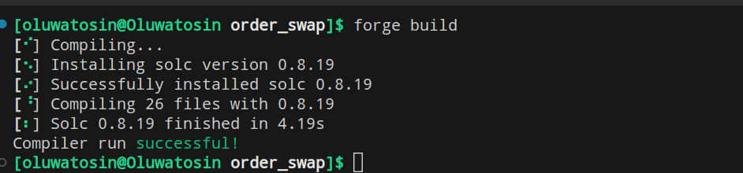

# Building an order-based swap decentralised platform on Celo using Foundry

In this tutorial, we will explore the process of building an order-based swap smart contract on the Celo blockchain utilizing the powerful features of Foundry. By leveraging the capabilities of Foundry, we can create a robust and efficient platform for executing order-based swaps.

Join me as we delve into the step-by-step development process, covering the necessary concepts, tools, and code examples required to build this innovative smart contract.

## Table of Contents

- [Building an order-based swap decentralised platform on Celo using Foundry]
  - [Introduction](#introduction)
  - [Table of Contents](#table-of-contents)
  - [Objective](#objective)
  - [Prerequisites](#prerequisites)
  - [Understanding Order-Based Swaps](#understanding-order-based-swaps)
    - [Order-based swaps structure](#order-based-swaps-structure)
  - [Tutorial](#tutorial)
    - [STEP 1 - Set up Foundry Environment](#step-1---set-up-foundry-environment)
    - [STEP 2 - Create your Smart contracts](#step-2---create-your-smart-contracts)
      - [Order Swap Smart Contract](#order-swap-smart-contract)
      - [Order Swap Smart Contract Explained](#order-swap-smart-contract-explained)
    - [STEP 3 - Deploying your contracts](#step-3---deploying-your-contracts)
    - [STEP 4 - Verifying your contracts](#step-4---verifying-your-contracts)
    - [Conclusion](#conclusion)
    - [Next Step]
    - [About Author]

## Objective

The objective of this tutorial is to provide readers knowledge on how to create an order-based swap smart contract on the Celo blockchain using Foundry. By the end of this tutorial, you will have a comprehensive understanding of the process involved in building an order-based swap smart contract on Celo using Foundry. Armed with this knowledge, developers will be equipped to contribute to the evolving landscape of DeFi on Celo and drive innovation in decentralized exchanges.

## Prerequisites

To ensure that you effectively follow through the process outlined in the tutorial, it is recommended that you have the following prerequisites:

- Basic Blockchain Knowledge: Familiarity with blockchain technology, its underlying concepts, and the basics of smart contracts is essential.
- Proficiency in the Solidity programming language used for writing smart contracts on the Celo blockchain and also used for testing in Foundry.
- Celo Wallet: Acquire a Celo-compatible wallet to interact with the Celo blockchain and deploy and test the smart contract. Examples include the Celo Extension Wallet or the Valora wallet or Metamask wallet.
- A text editor: For this tutorial, we will make use of Visual Studio Code, so ensure you have VS Code setup on your PC: VSCode is a popular integrated development environment (IDE) for building software.
- Have foundry installed, you can follow the process [here](https://book.getfoundry.sh/getting-started/installation)

## Understanding Order-Based Swaps

Order-based swaps refer to a type of transaction within decentralized finance (DeFi) that allows individuals to exchange tokens based on predetermined orders. These swaps rely on the concept of an order book, which acts as a central repository for buy and sell orders placed by participants. This type of swap is often used to hedge against market risk or to take advantage of price discrepancies between different markets.

In an order-based swap, participants can either submit limit orders or market orders. A limit order specifies the desired price at which the participant is willing to buy or sell tokens, while a market order indicates an immediate transaction at the best available price in the order book.

The order book facilitates the matching of buy and sell orders. When a buy order matches a sell order, a swap occurs, and the tokens are exchanged accordingly. This process enables participants to access liquidity and execute trades efficiently.

Order-based swaps offer several advantages. They provide participants with more control over the transaction price, allowing them to set specific parameters and potentially achieve better rates.

### Order-based swaps structure

- The parties agree to exchange the cash flows of their respective orders.
- The orders are specified in terms of the underlying security, the quantity of the security, and the price at which the security is to be exchanged.
- The swap is typically settled on a net basis, meaning that the party with the higher value of orders pays the difference to the party with the lower value of orders.

### Explaining the benefits and functionalities of order books, liquidity pools, and the role they play in facilitating efficient token swaps.

## Tutorial

### STEP 1 - Set up Foundry Environment

To begin setting up the Foundry environment for your smart contract implementation, you will first need to start a new project with Foundry, use forge init, like so:

```
forge init order_swap
```

This creates a new directory order_swap from the default foundry template. This also initializes a new git repository. Next, navigate to your project folder using the ‘cd’ command, like so:

```
cd order_swap
```

Once you have cd into the project folder, you can open your project folder in VScode by running this command in your terminal:

```
code .
```



This will open up your project folder in Visual Studio Code, where you can start writing your smart contract code.

### STEP 2 - Create your Smart contracts

In the root directory of your project, you'll find a folder named "src". To create a new contract file, simply navigate to this folder and add your new file.

Next thing we need to do is install OpenZeppelin in Foundry like so:

Open your VSCode terminal window and run the following command:

```solidity
forge install openzeppelin/openzeppelin-contracts
```

OR

```solidity
forge install openzeppelin/openzeppelin-contracts --no-commit
```

This will install OpenZeppelin in your Foundry project.

Once OpenZeppelin is installed, you need to create a remappings.txt file. This file will tell Foundry where to find the OpenZeppelin library.

```
touch remappings.txt
```

Open the remappings.txt file and add the following line:

```
openzeppelin/=lib/openzeppelin-contracts/
```

This line tells Foundry that the OpenZeppelin library can be found in the lib/openzeppelin-contracts/ directory.

Save the remappings.txt file and you are now ready to use OpenZeppelin in your Foundry project.
Here is an example of how to import the OpenZeppelin ERC20 library in your contract:

```
import { ERC20 } from "openzeppelin/contracts/token/ERC20/ERC20.sol";
```

Once you have imported the OpenZeppelin ERC20 library, you can use it for what you want in your project.

#### Order Swap Smart Contract

```solidity
// SPDX-License-Identifier: MIT
pragma solidity ^0.8.13;
import { ERC20 } from "openzeppelin/contracts/token/ERC20/ERC20.sol";

contract Swap {
  event OrderPlaced(
    address user,
    address tokenFrom,
    address tokenTo,
    uint256 amountIn,
    uint256 amountOut
  );
  event OrderExecuted(
    address tokenFrom,
    address tokenTo,
    address executor,
    uint256 amountIn,
    uint256 amountOut
  );

  enum Status {
    booked,
    completed
  }

  struct OrderDetails {
    address user;
    address tokenFrom;
    address tokenTo;
    uint256 amountIN;
    uint256 amountOUT;
    Status orderStatus;
  }

  uint256 ID = 1;
  mapping(uint256 => OrderDetails) _orderdetails;

  error InvalidOrderID();

  function placeOrder(
    address _tokenFrom,
    address _tokenTo,
    uint256 _amountIN,
    uint256 _amountOUT
  ) external {
    assert(
      ERC20(_tokenFrom).transferFrom(msg.sender, address(this), _amountIN)
    );

    OrderDetails storage OD = _orderdetails[ID];
    OD.user = msg.sender;
    OD.tokenFrom = _tokenFrom;
    OD.tokenTo = _tokenTo;
    OD.amountIN = _amountIN;
    OD.amountOUT = _amountOUT;
    OD.orderStatus = Status.booked;

    ID++;
    emit OrderPlaced(msg.sender, _tokenFrom, _tokenTo, _amountIN, _amountOUT);
  }

  function executeOrder(uint256 customerID) external {
    OrderDetails storage OD = _orderdetails[customerID];
    if (customerID > ID || customerID == 0) revert InvalidOrderID();

    uint256 amount = OD.amountOUT;
    address token = OD.tokenTo;

    assert(ERC20(token).transferFrom(msg.sender, address(this), amount));

    ERC20(OD.tokenFrom).transfer(msg.sender, OD.amountIN);
    ERC20(token).transfer(OD.user, amount);
    OD.orderStatus = Status.completed;

    assert(ERC20(OD.tokenFrom).balanceOf(msg.sender) >= OD.amountIN);
    assert(ERC20(OD.tokenTo).balanceOf(OD.user) >= amount);

    emit OrderExecuted(
      OD.tokenFrom,
      OD.tokenTo,
      msg.sender,
      OD.amountIN,
      amount
    );
  }

  function getOrderDetails(uint256 _ID)
    external
    view
    returns (OrderDetails memory)
  {
    if (_ID > ID || _ID == 0) revert InvalidOrderID();

    OrderDetails memory OD = _orderdetails[_ID];
    return OD;
  }
}

```

#### Order Swap Smart Contract Explained

The contract defines a struct called "OrderDetails" that contains information about an order, including the user address, token being swapped from, token being swapped to, the amount being swapped in, the amount being swapped out, and the order status.

**EVENTS** <br/>
These events provide a way to track and log the placement and execution of orders in the smart contract. They enable transparency and allow external systems or applications to listen for these events and perform actions based on the emitted data.

```solidity
event OrderPlaced(
    address user,
    address tokenFrm,
    address tokenTo,
    uint256 amountIn,
    uint256 amountOut
  );
  event OrderExecuted(
    address tokenFrom,
    address tokenTo,
    address executor,
    uint256 amountIn,
    uint256 amountOut
  );
```

These events "OrderPlaced" and "OrderExecuted" are emitted when an order is placed and when an order is executed, respectively. They provide information about the involved addresses, token amounts, and the executor of the order.

**ENUM** <br/>
The contract declares an enum called "Status" with two values: "booked" and "completed." This enum is used to track the status of a token order.

```solidity
enum Status {
  booked,
  completed
}

```

**VARIABLE** <br/>
The contract has a variable named "ID" that keeps track of the order ID for each new order placed. It is used as an identifier for the orders placed, allowing unique mapping of order details to their respective IDs. It is initialized to 1 and incremented with each new order.

```solidity
 uint256 ID = 1;
 mapping(uint256 => OrderDetails) _orderdetails;
```

The contract also includes a mapping named "\_orderdetails" that maps order IDs to their corresponding OrderDetails struct.
By using the ID variable and the \_orderdetails mapping, this code snippet enables the storage and retrieval of order details based on their unique IDs, facilitating order management and execution within the smart contract.

**FUNCTION** <br/>

1. The "placeOrder" function facilitates the creation of a new token swapping order by transferring the input tokens from the user to the contract and storing the order details for future execution.

```solidity
function placeOrder(
  address _tokenFrom,
  address _tokenTo,
  uint256 _amountIN,
  uint256 _amountOUT
) external {
  assert(ERC20(_tokenFrom).transferFrom(msg.sender, address(this), _amountIN));

  OrderDetails storage OD = _orderdetails[ID];
  OD.user = msg.sender;
  OD.tokenFrom = _tokenFrom;
  OD.tokenTo = _tokenTo;
  OD.amountIN = _amountIN;
  OD.amountOUT = _amountOUT;
  OD.orderStatus = Status.booked;

  ID++;
  emit OrderPlaced(msg.sender, _tokenFrom, _tokenTo, _amountIN, _amountOUT);
}

```

Here is an overview of how the function operates:

The function takes four parameters:

- \_tokenFrom: The address of the ERC20 token that the user wants to exchange.
- \_tokenTo: The address of the ERC20 token that the user wants to receive in exchange.
- \_amountIN: The amount of \_tokenFrom tokens that the user wants to exchange.
- \_amountOUT: The expected amount of \_tokenTo tokens that the user wants to receive.

The function begins by asserting that the contract successfully transfers the specified \_amountIN of \_tokenFrom tokens from the user's address to the contract's address using the transferFrom function of the ERC20 token.
<br/>

Next, a new OrderDetails struct is created and stored in the \_orderdetails mapping at the current ID. The struct is populated with the relevant order information, including the user's address, the source token address, the target token address, the input amount, the expected output amount, and the order status, which is set to Status.booked.
<br/>

After updating the order details, the order ID is incremented by one to prepare for the next order.

Then, the function emits the "OrderPlaced" event, providing information about the user, tokens involved, and the respective amounts.

2. The executeOrder function handles the execution of a specific order based on the provided customerID("ID").

```solidity
function executeOrder(uint256 customerID) external {
  OrderDetails storage OD = _orderdetails[customerID];
  if (customerID > ID || customerID == 0) revert InvalidOrderID();

  uint256 amount = OD.amountOUT;
  address token = OD.tokenTo;

  assert(ERC20(token).transferFrom(msg.sender, address(this), amount));

  ERC20(OD.tokenFrom).transfer(msg.sender, OD.amountIN);
  ERC20(token).transfer(OD.user, amount);
  OD.orderStatus = Status.completed;

  assert(ERC20(OD.tokenFrom).balanceOf(msg.sender) >= OD.amountIN);
  assert(ERC20(OD.tokenTo).balanceOf(OD.user) >= amount);

  emit OrderExecuted(OD.tokenFrom, OD.tokenTo, msg.sender, OD.amountIN, amount);
}

```

The executeOrder function is used to execute a previously placed order for token swapping. It takes the following parameter:

customerID: The ID of the order to be executed.
<br/>
The function begins by retrieving the OrderDetails struct corresponding to the provided "customerID" from the \_orderdetails mapping and storing it in the "OD" variable.
<br/>

Next, it checks if the "customerID" is invalid by comparing it with the current ID or checking if it is equal to 0. If the customerID is greater than the ID or equal to 0, it reverts the transaction with the "InvalidOrderID" error using the revert statement. If the customerID is valid, the function continues with the order execution process. It retrieves the amount of tokens to be received (amount) and the target token address (token) from the OD struct.
<br/>

The function then asserts that the contract successfully transfers the specified amount of the target token (token) from the caller's address to the contract's address using the transferFrom function of the ERC20 token.
<br/>

Afterwards, it transfers the input tokens (OD.amountIN) from the contract to the caller(msg.sender) using the transfer function of the ERC20 token. It also transfers the received tokens (amount) from the contract to the user who placed the order (OD.user).

The order status is then updated to Status.completed in the OD struct.
<br/>

The function includes assertions to verify that the token transfers were successful. It checks that the caller's balance of the input token (OD.tokenFrom) is greater than or equal to the input amount (OD.amountIN), and the user's balance of the target token (OD.tokenTo) is greater than or equal to the received amount (amount).

Finally, the OrderExecuted event is emitted to notify external systems about the successful execution of the order.

3. The getOrderDetails function allows external callers to retrieve the details of a specific order by providing the order ID.

```solidity
function getOrderDetails(uint256 _ID)
  external
  view
  returns (OrderDetails memory)
{
  if (_ID > ID || _ID == 0) revert InvalidOrderID();

  OrderDetails memory OD = _orderdetails[_ID];
  return OD;
}

```

It has the following parameters:

- \_ID: The ID of the order for which details are requested.

The function begins by checking if the provided \_ID is invalid. If \_ID is greater than the current ID or equal to 0, the function reverts the transaction with the "InvalidOrderID" error using the revert statement. If the \_ID is valid, the function retrieves the OrderDetails struct corresponding to the provided \_ID from the \_orderdetails mapping and stores it in the OD variable of type OrderDetails. The function then returns the OD struct, which contains the order details such as the user's address, token addresses for the source and target tokens, the amount to be exchanged, and the order status.
<br/>

#### Token Contract

To facilitate testing of the order swap contract, we need to create two token contracts. The first token contract, called "BananaToken," will represent the token that a user intends to swap. The second token contract, referred to as "MangoToken," will be the target token for the swap.

```solidity
//SPDX-License-Identifier: MIT
pragma solidity ^0.8.19;

import { ERC20 } from "openzeppelin/contracts/token/ERC20/ERC20.sol";

contract BananaToken is ERC20 {
  address owner;

  constructor() ERC20("Banana", "BANA") {
    owner = msg.sender;
    _mint(address(this), 2000000 * 10**decimals());
  }

  function mint(address to, uint256 amount) public {
    require(msg.sender == owner, "Not owner");
    _mint(to, amount);
  }
}

```

```solidity
//SPDX-License-Identifier: MIT
pragma solidity ^0.8.19;

import { ERC20 } from "openzeppelin/contracts/token/ERC20/ERC20.sol";

contract MangoToken is ERC20 {
  address owner;

  constructor() ERC20("Mango", "MNG") {
    owner = msg.sender;
    _mint(address(this), 2000000 * 10**decimals());
  }

  function mint(address to, uint256 amount) public {
    require(msg.sender == owner, "Not owner");
    _mint(to, amount);
  }
}

```

The contract "BananaToken" and "MangoToken" extends the ERC20 contract.

Constructor: The constructor function is executed when the contract is deployed. In this case, it sets the contract deployer (msg.sender) as the owner and mints an initial supply of 2,000,000 tokens to the contract itself for both tokens using the \_mint function inherited from ERC20.
<br/>

Mint Function: The contract includes a public function named "mint" that allows the owner (msg.sender) to mint additional Mango tokens. The function requires that the caller is the owner and then calls the \_mint function to mint the specified amount of tokens and assign them to the specified recipient (to).
<br/>

By deploying this contract, you can create instances of the Banana & Mango token and have the ability to mint new tokens if you are the owner of the contract.
<br/>

Next thing we need to do is to compile/build the contract. To build, use:

```
forge build
```

.

Now that our contract has successfully compiled, the next thing to do is to test the smart contract.

## STEP 3 - Deploying your contracts

## STEP 4 - Verifying your contracts

Demonstrating the interaction between the order book, liquidity pools, and the smart contract for seamless order execution.

## Conclusion

Summarizing the key insights gained throughout the article, emphasizing the significance of building order-based swap smart contracts on Celo using Foundry.
Highlighting the potential impact of these smart contracts in enhancing liquidity and trading capabilities within the Celo ecosystem.

## Next Step

## About Author
